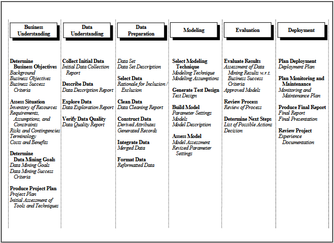
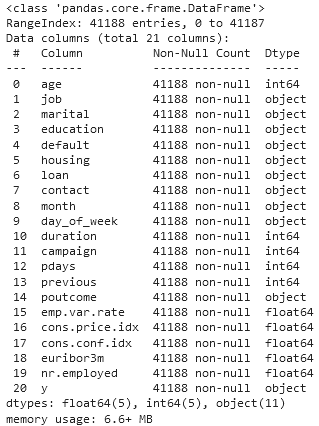
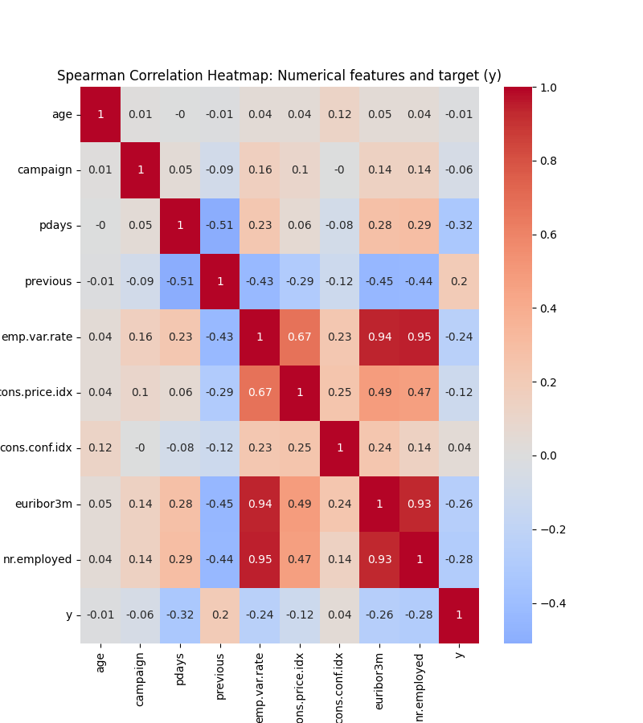
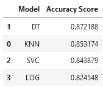
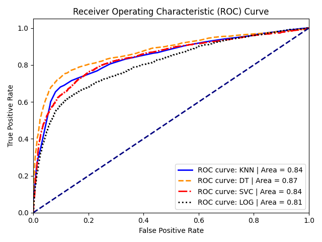
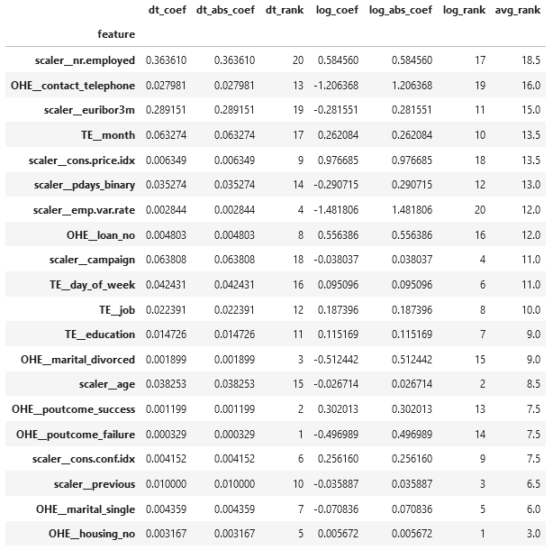

<h1 style="text-align: center; color: blue;">What predicts a term deposit subscription?</h1> 

This repo uses machine learning techniques to explore a <a href="https://archive.ics.uci.edu/dataset/222/bank+marketing">bank marketing dataset</a>. For this project, Python was used, in <a href = https://github.com/mattbenn/Practical-Application-3/blob/main/practical_application_3.ipynb>Jupyter Notebook</a>.

The CRISP-DM process model was used to conduct the project, as visualized below in Figures 1 and 2.

<h4 align="center"> Figure 1</h4>

<h4 align="center"> Figure 2</h4>

This report will contain a summary of the whole process; see the notebook for more details.
<h2>Business Understanding & Assessing the Situation</h2>
<h3>Determine Business Objectives</h3> Banks are interested in maximizing ROI for all initiatives, including marketing campaigns. Maximizing ROI for marketing campaigns requires businesses to understand the characteristics of potential and current customers who are most likely to purchase new products and services. One way of getting this information is to datamine previous marketing campaigns for information regarding customers who did and did not purchase products and services after being targeted by the campaign. This analysis will use information from one such campaign to identify the profiles of those who are likely to accept a certain kind of financial service.

<h3>Determine Business Objectives</h3> This analysis uses data, taken from published research, to examine the customer profiles of those who did and did not purchase the promoted service. I will be assuming that the final analysis and recommendations will be given to the original client who ran the campaign, for the purpose of future marketing efforts. Therefore, I will not be so concerned about how generalizable these findings may be across time, across cultures, across different socioeconomic strata, etc. The key benefit from this analysis is the capacity to identify the customer characteristics that best predict whether a customer will subscribe to a term deposit.

<h3>Data Mining Goals</h3> The goal of this project will be to identify the relationships between customer profile characteristics (predictors) and whether they purchased the promoted service (target). I will be comparing the efficacy and feasibility of using four different classifier models: K Nearest Neighbor (KNN), Decision Trees, Logistic Regression, and Support Vector Machines (SVMs). This will require a thorough evaluation of the dataset, identifying and possibly controlling for the bivaraiate and multivariate relationships between predictors, and making theoretically sound assumptions behind choosing which model to use to evaluate predictor-target relationships.

Data-mining will be considered successful if strong relationships can be found between customer characteristics and purchasing the service.

<h3>Project Plan</h3> The data has already been collected and partially cleaned. Therefore, only exploratory data analysis, further data cleaning, and data modeling are left. The project will consist of the aforementioned data preprocessing and data processing steps, as well as writing a summary of findings for presentation to the client (the Portugese banking institution).

<h2>Data Understanding</h2>
The <a href=https://github.com/mattbenn/Practical-Application-3/blob/main/data/bank-additional-full.csv>scraped dataset</a> is in .csv format and, before data cleaning, contains 21 features of over 41,000 observations:

Features include multiple characteristics of customers targeted in the ad campaign (e.g., age, job, marital status), as well as some features reflecting the economic context (e.g., consumer price index, number of employees at the bank). The target feature is whether a targeted customer subscribed to a term deposit, which is a categorical feature signifiying "yes" or "no". Over half of the features are categorical, meaning that we'll have to encode them before analysis.

No observations had missing data, but some categorical features had "unknown" values, signifying missing data. Those are dealt with in a few different ways, as detailed later.

<h2>Data Preparation</h2>
<h3>Data Cleaning</h3>

The data had 12 duplicate rows, which were removed.

After recoding "unknown" values as missing, only four features had over 1% of the data missing. <code>default</code>, which signifies if someone defaulted on a loan at the institution, had ~21% of its data missing; <code>education</code>, <code>housing</code>, and <code>loan</code> all had less than 5% of the data missing. After investigating, I discovered no consistent patterns between these features (e.g., it was not the case that <code>default</code> was always missing when one of the other features was missing data). I decided to keep the missing data as a legitimate third category for <code>default</code> (in addition to 'yes' and 'no'). For the other features, I used the <code>KNNImputer</code> estimator to impute the missing data values. After this importation, there were very few rows with missing data left, so I dropped any rows with missing data.

With the initial data cleaning completed, I moved on to data selection & feature engineering.

<h3>Data Selection & Feature Engineering</h3>
<b>Numeric Features:</b>

After converting the target <code>y</code> to a binary variable (with 0 = 'no' and 1 = 'yes'), I ran a Spearman correlation analysis to see how strongly each numeric variable related to the target:

<h4 align="center">Figure 3</h4>

I also transformed <code>pdays</code>, which recorded how many days had passed since a client had been contacted from a previous ad campaign. Originally a numeric value, this feature showed a strong relationship to the target variable, but it was almost entirely due to an artifact of how it was coded: Clients who were never contacted were coded with the real value 999, and actual values ranged from 1 - 6. When excluding those coded as 999 the correlation disappeared, and so to preserve the information and reduce noise I transformed the feature to a binary, with 1 representing no contact an 0 representing contact.

I made adjustments, either by log transforming or dropping outliers, for other features.

<b>Categorical Features:</b>

I carefully reviewed the number of unique categories in each categorical feature. After doing so, I decided to remove <code>default</code> because it was almost always 'yes' (making it an extremely unbalanced class and basically useless for prediction) and <code>duration</code> (because the article's authors noted that it should be removed).

After evaluating the reamining categorical columns I decided on whether to use one-hot encoding (OHE) or target encoding (TE), depending on how many categories existed. Features with three or less values (<code>marital</code>, <code>housing</code>, <code>loan</code>, <code>contact</code>, and <code>poutcome</code>) were encoded with OHE, while the rest (<code>job</code>, <code>education</code>, <code>month</code>, <code>day_of_week</code>) used TE. This way, I kept the dimensionality of the dataset reasonably low.

<b>Oversampling</b>

In the unfiltered dataset the target variable, <code>y</code>, was significantly imbalanced. ~89% of cases were 0 ('no'), meaning that the customer did not subscribe to the term deposit. I wanted to increase the representation of the minority class (1, 'yes') to be at least 25% of the data, and so I used the <code>SMOTENC</code> function to oversample the minority class. This resulted in a dataset with 47.3k observations, with 25% of the <code>y</code> values being 1.

With this, the data was prepared for modeling.
<h2>Modeling</h2>

I tried four different classification models: logistic regression, K nearest neighbor (KNN), decition tree classifier, and support vector machine (SVM). For all data modeling, I used an 80/20 test-train split, stratified on the <code>y</code> (training) feature, with 5-fold cross-validation.

Without more information about the cost-benefit ratio for marketing efforts, it is difficult to identify the best metric by which to evaluate these models. I will use both accuracy (reported below as a percentage of target cases classified correctly) and the area under the curve of a receiver-operator curve (ROC), or the ROC-AUC. Accuracy gives a good holistic understanding of model effectiveness. The ROC-AUC is useful for comparing across models and is also robust against imbalanced datasets like ours.

<h3>Modeling</h3>

First, I created a logistic regression model, using grid search methods to find optimal hyperparameters. I then went on to test the other models. Because other models have more hyperparameters to estimate, and SVM models take a long time to run on datasets this large, I opted for a strategy of running 100 hyperparameter searches using the <code>HalvingRandomSearchCV</code> function. Hyperparameter for each model are reported below; metrics will be reported and visualized in the next section.
<ul>
<li><b>Logistic Regression</b>: L2 Regularization
<li><b>Decision Tree Classifier</b>: A <code>ccp_alpha</code> value of 7.922e-05. The best DT model had a depth of 30 and 431 leaves.
<li><b>KNN</b>: A <i>k</i>-value of 147, weighted by neighbor distance.
<li><b>SVM</b>: C = 10, gamma = 0.1
</ul>
<h2>Model Comparison and Evaluation</h2>
<h3>Model Coefficients</h3>
The ROC-AUC curves and the accuracy scores for the best perfoming models are shown below.

All models performed better than the baseline (which would be 75%, since that was the total proportion of the majority class in the target feature). The decision tree classifier model performed the best, with an accuracy of 87.2% and an ROC-AUC of 0.87.

<h3>Interpreting Model Features</h3>
It is easy to compare the relative strength of coefficients across models. I did so by getting the coefficient values from the logistic regression models and the feature importance values from the decision tree model, rank-ordered them by absolute magnitude, and then averaging across ranks:

I chose the decision tree model because it was the highest-perfoming model, and the logistic regression because it can easily tell us the direction of the relationship between the predictor feature and the target (i.e., positive or negative). Interestingly, there was a negative Spearman's rho correlation between the rank-order of coefficient strengths, meaning that which features are important may change depending on the modelling methodology used. However, we can observe some patterns by observing these coefficients:

<ul>
<li>For the decision tree model, two features--<code>nr.employed</code> (number of employees at bank) and <code>euribor3m</code> (Euribor 3-month interest rate)--were far more important than all other features, as represented by the sudden drop in importance magnitude (which is the total loss of entropy associated with decision nodes involving that feature).
<li>For the logistic model, more features were of relatively high importance.
</ul>

Next, I'll discuss the practical results from these findings.

<h2>Findings & Future Directions</h2>
The business objective for this project was to identify the characteristics of clients that are likely to subscribe to a term deposit. Certain features do stand out:

<ul>
<li>Economic context variables, such as employee variation rate (<code>emp.var.rate</code>), euribor 3 month rate (<code>euribor3m</code>), and consumer price index (<code>con.price.idx</code>), and are some of the strongest predictors. These likely correlate strongly with consumer's confidence in the economy, which affects their willingness to purchase economic services.
<li>Variables possibly related to time of year--e.g., number of employees (<code>nr.employed</code>) and month of year (<code>month</code>)--are important predictors. The bank should look further into this and identify why this may be the case.
<li>Other strong indicators are likely corrlated with wealth. For example, method of contact (<code>contact</code>): those contacted via a telephone were less likely to purchase the service than those contacted via cell phone, and it is possible that those with cellular phones belong to higher socioeconomic strata and are more likely to purchase financial products in the first place. Additionarlly, those who purchased services or products from the bank previously were more likely to purchase subscribe to this product. However, those who did not have a loan were <i>more</i> likely to subscribe to the product, so there are some unanswered questions about how customer profiles relate to whether they'll purchase a service or not.
<li>Given that the strongest predictors correlate with consumer's willingness and capacity to invest, it would probably be useful to also look at factors such as the balance of customers' open accounts. Given the patterns observed, it is likely that those with higher balances would be more likely to purchase services.
</ul>

These ingsights give a strong direction for next steps for a regional bank to take when data mining for insights into marketing campaigns.
